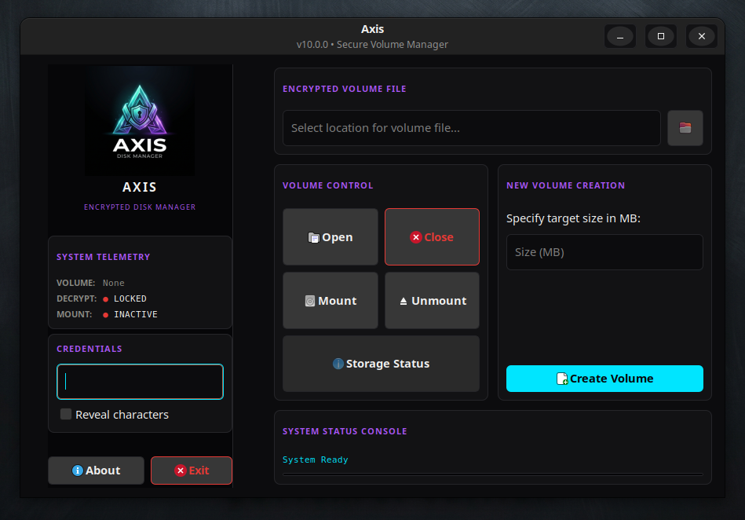
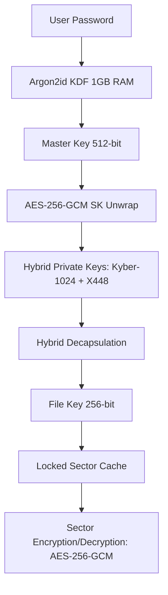

<div align="center">

<a href="https://github.com/effjy/axis/"></a>


[](LICENSE)
[](#)
[](#)
[](#)

<br>

**Axis** is an ultra-secure, high-performance encrypted disk manager engineered for the modern security paradigm. Powered by hardware-accelerated **AES-256-GCM** encryption and a robust hybrid post-quantum key encapsulation mechanism, Axis provides state-of-the-art security margins across all volume layers. By combining cutting-edge lattice-based cryptography, elliptic curve cryptography, and hardware-accelerated CPU instruction sets, it ensures your data remains completely private even against future quantum computing adversaries.

</div>

<br>

---

## 📸 Screenshot

<div align="center">
  
  <br/><br/>
  <em>The Axis main dashboard — dark‑themed GTK interface for volume management</em>
</div>

<br>

---

## 🌌 Key Highlights

- 🛡️ **State-of-the-Art Security Margin** — Full AES-256-GCM authenticated encryption providing cryptographic integrity and confidentiality at the hardware level.
- 🧬 **Hybrid Key Encapsulation (KEM)** — Combines post-quantum **Kyber-1024** (lattice-based) and classical **X448** (elliptic curve Diffie-Hellman) to secure master and file keys.
- ⚡ **Hardware-Accelerated Engine** — Hand-tuned utilization of AES-NI and AVX2 instruction sets via OpenSSL's EVP framework for lightning-fast disk I/O performance.
- 🌑 **Plausible Deniability** — Full **IND-RND** compliance: volumes have no identifiable headers, signatures, or metadata blocks, rendering them mathematically indistinguishable from raw thermal noise or random data.
- 🔒 **Anti-Brute Force Protection** — Uses **Argon2id** key derivation locked with 1 GB of RAM to render GPU- and ASIC-based brute-force attacks economically and computationally impossible.
- 🔄 **Dual-Generation Compatibility** — Seamless trial-decryption supports legacy and next-generation volume structures.
- 🐧 **FUSE 3 Mounting** — Exposes encrypted containers as transparent, read-write filesystem directories in user space.

<br>

---

## 🛠️ Cryptographic Architecture

Axis employs a multi-tiered cryptographic design to protect files from physical and quantum adversaries:



### Encryption & Decryption Scheme

1. **Key Wrapping**: Secret keys and KEM parameters are wrapped using **AES-256-GCM** with sector-specific nonces.
2. **File Stream Layer**: For file operations, Axis divides streams into fixed 4 MB segments. Each segment is processed independently in parallel using a thread-pool (up to 8 hardware threads):
   - **Encryption**: Conducted via **AES-256-GCM** with unique per-segment derived nonces.
   - **Decryption**: Performed via **AES-256-CTR** for optimal random-access stream capabilities, with GCM integrity verification checking a final aggregated hash at completion.
3. **Sector Cache Layer**: Disk sectors are encrypted/decrypted via **AES-256-GCM**, where the sector index is utilized as part of the GCM Initialization Vector (IV) and Additional Authenticated Data (AAD) to prevent sector relocation or replay attacks.

<br>

---

## 📋 Prerequisites

To compile and run Axis on Linux, ensure you have the following packages installed:

### Build System & Compilers
- **GCC** (with AVX2 instruction set support and C11/GNU11 standard compatibility)
- **GNU Make**
- **pkg-config**

### Required Libraries
- **libsodium** (Cryptographic primitives)
- **libcrypto** (OpenSSL EVP for hardware-accelerated AES-256-GCM/CTR & X448)
- **FUSE 3** (`libfuse3-dev` / `fuse3` — Virtual filesystem interface)

### Graphical User Interface (GTK)
- **GTK 3** or **GTK 4** development libraries (used to build the modern dark-themed graphical dashboard)
- **ncurses** (automatically falls back to a terminal UI if no GUI environment is found)

### Install Dependencies (Debian/Ubuntu)
```bash
sudo apt update
sudo apt install build-essential pkg-config libsodium-dev libssl-dev libfuse3-dev libgtk-3-dev libncurses5-dev
```

<br>

---

## ⚙️ Compilation & Installation

### 1. Dependency Validation
Validate that all required tools and libraries are present on your system:
```bash
make check-deps
```

### 2. Compilation
To build the optimized production binary (automatically detects CPU features and utilizes hardware accelerations):
```bash
make
```

*To inspect the underlying compiler flags and commands during build, run in verbose mode:*
```bash
make V=1
```

### 3. Installation
Install the application globally, which copies the executable to `/usr/local/bin`, registers the desktop application shortcut, and installs the Axis icon and brand assets:
```bash
sudo make install
```

### 4. Uninstallation
To completely remove Axis and its configuration entries from the host system:
```bash
sudo make uninstall
```

<br>

---

## 🚀 How to Use

### Launching the Application
If installed globally, launch Axis from your desktop applications menu, or invoke it directly:
```bash
axis
```

Alternatively, execute it out of the build directory:
```bash
make run
```

### Volume Management Workflow

#### 1. Creating a Secure Container
1. Enter the target output path for the volume in the **Encrypted Volume File** box.
2. Specify the size of the volume in Megabytes (minimum: 10 MB, maximum: 1 TB).
3. Type a strong passphrase in the **Credentials** card.
4. Click **Create Volume**. A progress bar will reflect the structural creation and formatting of the virtual filesystem.

#### 2. Accessing (Mounting) an Existing Volume
1. Click the **Browse** folder icon to select your encrypted volume file.
2. Type the password in the **Credentials** pane.
3. Click **Open**. The status panel will confirm the trial-decryption status.
4. Click **Mount** and select a target folder directory in your filesystem. The FUSE daemon will run in the background, mounting the volume.
5. You can now read, write, copy, and modify files within that folder.
6. Once finished, click **Unmount** and **Close** to flush all modifications to disk and lock the cryptographic keys.

<br>

---

## 🔒 Security Best Practices

> [!WARNING]
> **Unencrypted Swap Partition Alert**
>
> Upon startup, Axis inspects `/proc/swaps` to determine if unencrypted swap memory is active. If detected, it displays a security warning. Unencrypted swap can write active memory pages containing keys or plaintexts to persistent storage, compromising security. It is highly recommended to disable swap (`sudo swapoff -a`) or encrypt it using LUKS.

> [!IMPORTANT]
> **Memory Locking (mlock)**
>
> Axis attempts to call `sodium_mlock` on all sensitive key containers, file handles, and cache sectors to prevent them from being paged out to disk. To enable this, ensure your user shell has sufficient limits or run the program with elevated privileges.

<br>

---

## 👥 Authors & Contact

- **Lead Cryptographer & GUI Developer** — Jean-Francois Lachance-Caumartin (Effjy)
- **Contact** — [effjy@protonmail.com](mailto:effjy@protonmail.com)

This project is licensed under the MIT License - see the [LICENSE](LICENSE) file for details.
