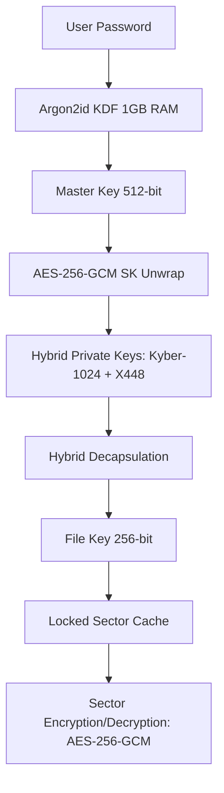

<div align="center">

<a href="https://github.com/effjy/axis/"></a>


[](LICENSE)
[](#)
[](#)
[](#)

<br>

**Axis** is a Linux encrypted disk manager for creating and mounting encrypted volumes. It uses AES-256-GCM for the data layer and a hybrid post-quantum key encapsulation mechanism (Kyber-1024 + X448) to wrap the keys, so a volume stays protected as long as *either* the lattice scheme or the elliptic-curve scheme remains unbroken. The goal is practical confidentiality today with a hedge against future quantum attacks.

> **Status: experimental, unaudited.** Axis is built and maintained by a single developer and has not had an independent cryptographic audit. Do not rely on it as your only protection for data you cannot afford to lose or expose. Review the [Threat Model](#-threat-model) before use.

</div>

<br>

---

## 📸 Screenshot

<div align="center">
  
  <br/><br/>
  <em>The Axis main dashboard — dark‑themed GTK interface for volume management</em>
</div>

<br>

---

## 🌌 Key Highlights

- 🛡️ **AES-256-GCM data layer** — Authenticated encryption providing confidentiality and integrity for sectors and file streams.
- 🧬 **Hybrid Key Encapsulation (KEM)** — Combines post-quantum **Kyber-1024** (lattice-based) with classical **X448** (ECDH). Master and file keys stay protected as long as either primitive holds.
- ⚡ **Hardware acceleration** — Uses AES-NI and AVX2 via OpenSSL's EVP framework when the CPU supports them, for fast disk I/O.
- 🌑 **Header-less volumes** — Containers carry no identifiable headers, signatures, or metadata blocks, so a volume is intended to be indistinguishable from random data. See the [Threat Model](#-threat-model) for the limits of this property.
- 🔒 **Memory-hard KDF** — **Argon2id** configured with 1 GB of RAM to raise the cost of GPU- and ASIC-based brute-force attacks.
- 🔄 **Dual-generation compatibility** — Trial-decryption supports both legacy and current volume structures.
- 🐧 **FUSE 3 mounting** — Exposes an open volume as a transparent, read-write directory in user space.

<br>

---

## 🛠️ Cryptographic Architecture

Axis uses a multi-tiered key hierarchy to separate the password, the long-term keys, and the per-sector data keys:



### Encryption & Decryption Scheme

1. **Key Wrapping**: Secret keys and KEM parameters are wrapped with **AES-256-GCM** using sector-specific nonces.
2. **File Stream Layer**: File operations are split into fixed 4 MB segments processed in parallel by a thread pool (up to 8 hardware threads):
   - **Encryption**: **AES-256-GCM** with unique per-segment derived nonces.
   - **Decryption**: **AES-256-CTR** for random-access reads, with GCM integrity verified against a final aggregated authentication tag.
3. **Sector Cache Layer**: Disk sectors are encrypted with **AES-256-GCM**, where the sector index is folded into the IV and Additional Authenticated Data (AAD) to resist sector relocation and replay.

<br>

---

## 🧭 Threat Model

Understanding what Axis does and does not defend against is essential to using it safely.

### What Axis aims to protect against

- **Data-at-rest disclosure.** If an attacker obtains the volume file (lost laptop, seized drive, stolen backup) while it is **not mounted**, the contents should be unrecoverable without the passphrase.
- **Offline brute-force.** The Argon2id KDF (1 GB RAM) is intended to make large-scale password guessing expensive, assuming a reasonably strong passphrase.
- **Future quantum attacks on the key exchange.** The Kyber-1024 + X448 hybrid is meant to keep wrapped keys secure even if a quantum adversary later breaks X448, and vice versa for any future weakness in Kyber.
- **Sector tampering and reordering.** Per-sector GCM tags with the sector index as AAD are intended to detect modification, relocation, or rollback of ciphertext sectors.

### What Axis does *not* protect against

- **A compromised running system.** Malware, a malicious root user, a keylogger, or a kernel-level implant on the machine can capture your passphrase or read decrypted data while a volume is mounted. Axis cannot defend a host that is already owned.
- **Memory exposure while mounted.** Keys and plaintext exist in RAM during use. Axis calls `sodium_mlock` to avoid swapping, but a cold-boot attack, a DMA attack, or a memory dump of the running process can still expose them.
- **Coercion (rubber-hose).** Header-less volumes provide *deniability of structure*, not protection from a determined adversary who can compel you to reveal a passphrase. Deniability is also weakened by side evidence — file timestamps, mount history, shell logs, application MRU lists, and the mere presence of Axis on the system.
- **Traffic and metadata analysis.** Axis does not hide that encryption software is installed, nor file sizes, access patterns, or the existence of a large random-looking file. The indistinguishable-from-random property is a design goal of the volume contents, not a guarantee against forensic inference from the surrounding system.
- **Implementation flaws.** This code is unaudited. Bugs in the C implementation, the key hierarchy, nonce handling, or the KEM combiner could undermine any of the above. Treat the security claims as design intent pending external review.
- **Weak passphrases.** No KDF saves a guessable password. The strength of everything above rests on your passphrase entropy.
- **Side channels.** Timing, cache, and power side channels in the underlying primitives or this code are out of scope and not specifically mitigated.

### Assumptions

Axis assumes a trusted, malware-free host at the time of volume creation and mounting, a passphrase with sufficient entropy, and correct functioning of the underlying libraries (libsodium, OpenSSL, FUSE 3). If any of these assumptions fails, the corresponding protections may not hold.

<br>

---

## 📋 Prerequisites

To compile and run Axis on Linux, ensure you have the following packages installed:

### Build System & Compilers
- **GCC** (with AVX2 instruction set support and C11/GNU11 standard compatibility)
- **GNU Make**
- **pkg-config**

### Required Libraries
- **libsodium** (Cryptographic primitives)
- **libcrypto** (OpenSSL EVP for hardware-accelerated AES-256-GCM/CTR & X448)
- **FUSE 3** (`libfuse3-dev` / `fuse3` — Virtual filesystem interface)

### Graphical User Interface (GTK)
- **GTK 3** or **GTK 4** development libraries (used to build the dark-themed graphical dashboard)
- **ncurses** (automatically falls back to a terminal UI if no GUI environment is found)

### Install Dependencies (Debian/Ubuntu)
```bash
sudo apt update
sudo apt install build-essential pkg-config libsodium-dev libssl-dev libfuse3-dev libgtk-3-dev libncurses5-dev
```

<br>

---

## ⚙️ Compilation & Installation

### 1. Dependency Validation
Validate that all required tools and libraries are present on your system:
```bash
make check-deps
```

### 2. Compilation
To build the optimized production binary (detects CPU features and enables hardware acceleration where available):
```bash
make
```

*To inspect the underlying compiler flags and commands during build, run in verbose mode:*
```bash
make V=1
```

### 3. Installation
Install the application globally, which copies the executable to `/usr/local/bin`, registers the desktop application shortcut, and installs the Axis icon and brand assets:
```bash
sudo make install
```

### 4. Uninstallation
To completely remove Axis and its configuration entries from the host system:
```bash
sudo make uninstall
```

<br>

---

## 🚀 How to Use

### Launching the Application
If installed globally, launch Axis from your desktop applications menu, or invoke it directly:
```bash
axis
```

Alternatively, execute it out of the build directory:
```bash
make run
```

### Volume Management Workflow

#### 1. Creating a Secure Container
1. Enter the target output path for the volume in the **Encrypted Volume File** box.
2. Specify the size of the volume in Megabytes (minimum: 10 MB, maximum: 1 TB).
3. Type a strong passphrase in the **Credentials** card.
4. Click **Create Volume**. A progress bar will reflect the structural creation and formatting of the virtual filesystem.

#### 2. Accessing (Mounting) an Existing Volume
1. Click the **Browse** folder icon to select your encrypted volume file.
2. Type the password in the **Credentials** pane.
3. Click **Open**. The status panel will confirm the trial-decryption status.
4. Click **Mount** and select a target folder directory in your filesystem. The FUSE daemon will run in the background, mounting the volume.
5. You can now read, write, copy, and modify files within that folder.
6. Once finished, click **Unmount** and **Close** to flush all modifications to disk and lock the cryptographic keys.

<br>

---

## 🔒 Security Best Practices

> [!WARNING]
> **Unencrypted Swap Partition Alert**
>
> Upon startup, Axis inspects `/proc/swaps` to determine if unencrypted swap memory is active. If detected, it displays a security warning. Unencrypted swap can write active memory pages containing keys or plaintexts to persistent storage, compromising security. It is highly recommended to disable swap (`sudo swapoff -a`) or encrypt it using LUKS.

> [!IMPORTANT]
> **Memory Locking (mlock)**
>
> Axis attempts to call `sodium_mlock` on all sensitive key containers, file handles, and cache sectors to prevent them from being paged out to disk. To enable this, ensure your user shell has sufficient limits or run the program with elevated privileges.

<br>

---

## 👥 Authors & Contact

- **Developer** — Jean-Francois Lachance-Caumartin (Effjy)
- **Contact** — [effjy@protonmail.com](mailto:effjy@protonmail.com)

Axis is **experimental, unaudited software**. Independent review, cryptanalysis, and bug reports are genuinely welcome — please open an issue or get in touch.

This project is licensed under the MIT License - see the [LICENSE](LICENSE) file for details.
